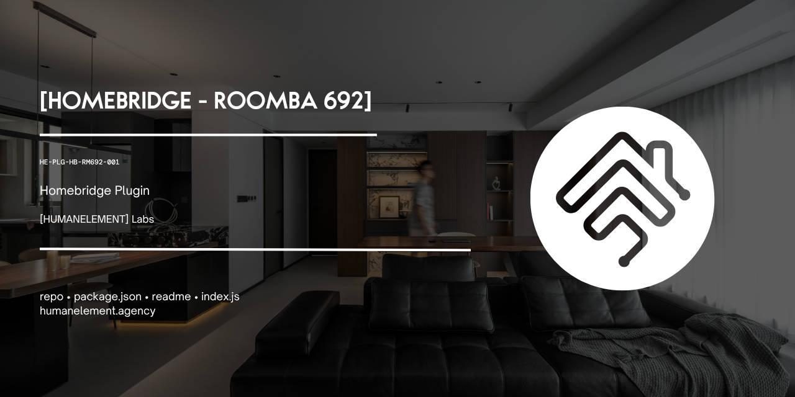

# homebridge-roomba692



[](https://github.com/homebridge/homebridge)
[](https://nodejs.org)
[](https://opensource.org/licenses/MIT)

Homebridge plugin for the iRobot Roomba 692 (and other 600-series models).

Exposes the Roomba as a **Switch** in HomeKit — on means cleaning, off means dock. Also provides a **Battery** tile showing charge level and charging state.

## Why this plugin?

Existing Roomba plugins show "No Response" in HomeKit when running on Node 18+ (Raspberry Pi OS Bookworm). There are two compounding causes:

1. **OpenSSL 3 rejects the Roomba's certificate** — The Roomba 692 uses a SHA-1 self-signed TLS certificate. OpenSSL 3 (shipped with Node 18+ on Pi OS Bookworm) rejects SHA-1 certs at the default security level. This plugin patches the TLS layer at startup to allow the connection.

2. **Broken async patterns in older plugins** — `await setTimeout()` doesn't work (setTimeout returns void, not a Promise). This silently breaks the async chain, so HomeKit callbacks are never called. This plugin uses `await new Promise(resolve => setTimeout(resolve, ms))` throughout.

## Prerequisites

- Homebridge installed and running
- Roomba 692 on the same WiFi network as your Homebridge host
- Your Roomba's BLID and local password (see below)

## Getting your BLID and password

Run this once on any machine with Node.js installed:

```bash
npm install -g dorita980
get-roomba-password-cloud your@email.com yourPassword
```

Note the BLID and Password values from the output. These go in your config.

## Installation

Copy the plugin folder to your Raspberry Pi, then:

```bash
cd /path/to/homebridge-roomba692
npm install
sudo npm install -g .
```

Then restart Homebridge:

```bash
sudo hb-service restart
```

## Homebridge config.json

Add to the `"platforms"` array in your Homebridge `config.json`:

```json
{
  "platforms": [
    {
      "platform": "Roomba692Platform",
      "name": "Roomba",
      "blid": "YOUR_BLID_HERE",
      "robotpwd": "YOUR_PASSWORD_HERE",
      "ipaddress": "192.168.x.x",
      "model": "Roomba 692"
    }
  ]
}
```

**Migrating from homebridge-roomba-stv?** Your `blid`, `robotpwd`, and `ipaddress` values stay the same. Just update the config key to `"platform": "Roomba692Platform"` and uninstall the old plugin.

**Tip:** Set a static DHCP lease for your Roomba in your router so the IP never changes.

## Config options

| Field | Required | Description |
|-------|----------|-------------|
| `platform` | Yes | Must be `"Roomba692Platform"` |
| `name` | Yes | Display name in Home app |
| `blid` | Yes | Robot BLID from dorita980 |
| `robotpwd` | Yes | Robot password from dorita980 |
| `ipaddress` | Yes | Robot's local IP address |
| `model` | No | Model string shown in Home app (default: `"Roomba 692"`) |
| `timeout` | No | Seconds to wait for a response (default: 12) |

## Usage

- **Turn on** in Home app → Roomba starts cleaning
- **Turn off** in Home app → Roomba pauses then returns to dock
- **Battery tile** → shows current battery percentage and charging status

## Mobile app note

The Roomba 692 supports only one local connection at a time. While Homebridge is communicating with the robot (a few seconds per operation), the iRobot app may temporarily fall back to cloud control. The plugin connects and disconnects quickly to keep this window minimal.

## Troubleshooting

**Still shows "No Response"**
- Confirm the Roomba is on WiFi and pingable from the Pi: `ping 192.168.x.x`
- Confirm your BLID and robotpwd are correct — test with the dorita980 CLI
- Check Homebridge logs: `sudo hb-service logs`

**Robot doesn't dock when I turn it off**
- The Roomba must be actively cleaning (Switch = ON) for the dock command to work. If it's already docked, turning it off is a no-op.

**Battery shows 50%**
- This is the fallback value when battery data isn't available from the MQTT stream. It doesn't affect the Switch functionality.

---

*A [HumanElement](https://HumanElement.agency) idea* <br />
*Made with love by HumanElement & Claude <3*
